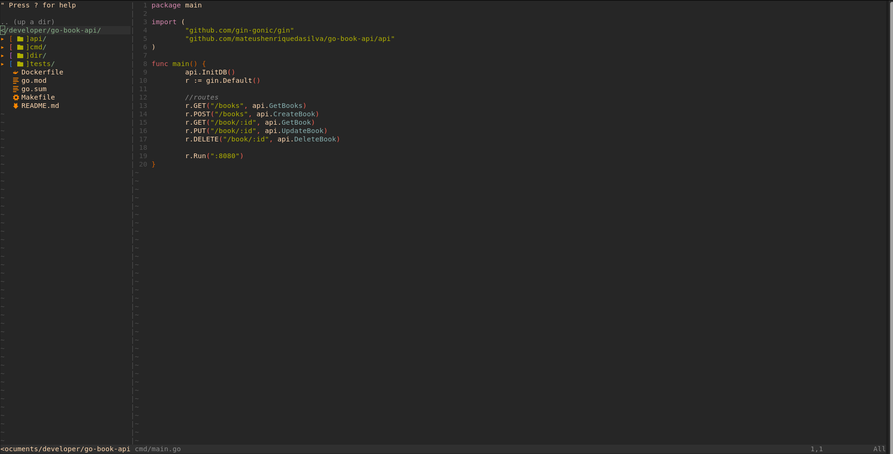

# Vim Config

Configuracao pessoal de Vim com foco em produtividade para Go/Java, autocompletar via LSP, navegacao em arvore e icones.



## Novas atualizações

- **2026-05-29** — Estrutura do README atualizada com uma seção de changelog e instruções rápidas de validação.
- **Como aplicar**: após atualizar a configuração, rode `:PlugInstall` e `:GoInstallBinaries` dentro do Vim.
- Se você tiver as alterações específicas, me diga que eu atualizo o changelog com detalhes.

## O que esta configurado

- `coc.nvim`: autocompletar, diagnosticos e LSP
- `vim-go`: recursos de Go (incluindo `GoImports` no save)
- `vim-polyglot`: sintaxe para varias linguagens (inclui Java)
- `nerdtree` + `vim-devicons`: explorador de arquivos com icones
- `gruvbox-material`: tema
- `rainbow`: destaque de parenteses/chaves
- `vim-better-whitespace`: destaque de espacos/tabulacoes
- `vim-startify`: tela inicial com arquivos recentes/sessoes

## Pre-requisitos

Instale os itens abaixo antes de usar a configuracao:

1. Vim 8+ com suporte a `+terminal`
2. `git` e `curl`
3. Node.js LTS + npm (obrigatorio para `coc.nvim`)
4. Go (para `vim-go`, `gopls` e `goimports`)
5. JDK 17+ (recomendado para `coc-java`)
6. Nerd Font no terminal (para os icones do `vim-devicons`)

## Instalacao rapida (Ubuntu/Debian)

```bash
sudo apt update
sudo apt install -y vim git curl nodejs npm golang-go openjdk-17-jdk
```

## Instalacao rapida (macOS com Homebrew)

```bash
brew install vim git curl node go openjdk@17
```

## Instalar o vim-plug (plugin manager)

```bash
curl -fLo ~/.vim/autoload/plug.vim --create-dirs \
	https://raw.githubusercontent.com/junegunn/vim-plug/master/plug.vim
```

## Aplicar esta configuracao

1. Backup do arquivo atual:

```bash
cp ~/.vimrc ~/.vimrc.backup 2>/dev/null || true
```

2. Clone o repositorio:

```bash
git clone https://github.com/mateushenriquedasilva/vim-config.git
cd vim-config
```

3. Copie a configuracao:

```bash
cp .vimrc ~/.vimrc
```

No Windows (PowerShell):

```powershell
Copy-Item .vimrc $HOME\_vimrc -Force
```

## Instalar plugins e dependencias do editor

Abra o Vim e execute:

```vim
:PlugInstall
:GoInstallBinaries
:CocInstall coc-go coc-java
```

Observacoes:

- A linha `let g:coc_global_extensions = ['coc-go', 'coc-java']` ja deixa essas extensoes definidas.
- O comando `:CocInstall` acima garante a instalacao imediata.

## Dependencias de linguagem (Go/Java)

### Go

Instale as ferramentas usadas pelo LSP/formatacao:

```bash
go install golang.org/x/tools/gopls@latest
go install golang.org/x/tools/cmd/goimports@latest
```

Garanta que o binario do Go esteja no PATH:

```bash
echo 'export PATH="$PATH:$(go env GOPATH)/bin"' >> ~/.bashrc
source ~/.bashrc
```

### Java

`coc-java` funciona melhor com JDK 17+ instalado.

Valide:

```bash
java -version
javac -version
```

## Nerd Font (icones no NERDTree)

Sem Nerd Font, os icones podem aparecer quebrados (quadrados/simbolos estranhos).

1. Instale uma fonte Nerd Font (ex.: FiraCode Nerd Font, JetBrainsMono Nerd Font).
2. Configure essa fonte no terminal que voce usa para abrir o Vim.
3. Reabra o terminal e o Vim.

## Atalhos e comportamento desta configuracao

- `F2`: abre/fecha NERDTree
- `F1`: abre terminal dentro do Vim
- Numeracao de linhas ativa (`set number`)
- Ao salvar arquivo Go, roda `:GoImports` automaticamente

## Como validar se esta tudo OK

No terminal:

```bash
vim --version | head -n 5
node -v
npm -v
go version
```

Dentro do Vim:

```vim
:PlugStatus
:CocInfo
:echo executable('gopls')
:echo executable('goimports')
```

Se os dois ultimos comandos retornarem `1`, os binarios estao acessiveis.

## Troubleshooting

### `:PlugInstall` nao existe

`vim-plug` nao foi instalado corretamente. Refaça a secao de instalacao do `vim-plug`.

### `coc.nvim` nao inicia

Verifique Node.js e npm:

```bash
node -v
npm -v
```

### `GoImports` falha ao salvar

Normalmente falta `goimports` no PATH. Reinstale com `go install ...` e confirme `:echo executable('goimports')`.

### Icones estranhos no NERDTree

Fonte do terminal nao e Nerd Font, ou nao foi aplicada ao perfil atual do terminal.

## Estrutura do repositorio

- `.vimrc`: configuracao principal
- `img/`: imagens de referencia

## Licenca

Consulte o arquivo `LICENSE`.
